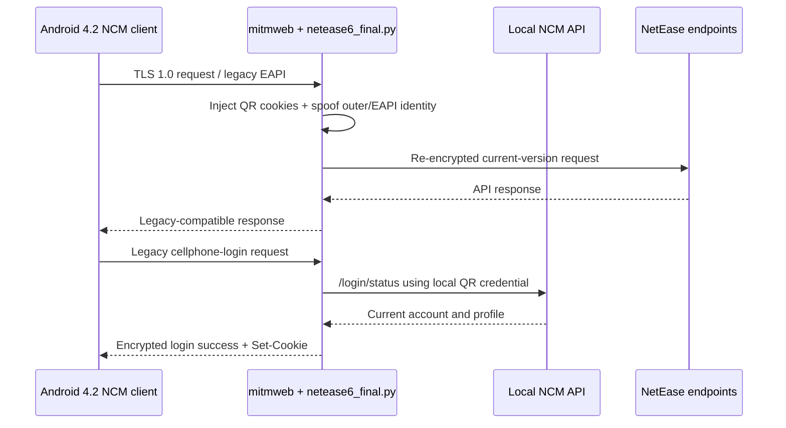

# NeteaseMusic Legacy Android Compat

A local compatibility bridge for a legacy NetEase Cloud Music Android client on Android 4.2.2. The validated addon combines TLS 1.0 client support, outer request identity spoofing, EAPI header decryption and re-signing, and QR-session login-state injection.

This repository is built from the actual `netease6_final.py` and launch script used during device testing. The protocol transformations remain intact; credential paths, local API address, listen address, and spoofed client version are now configurable. No real cookie, token, account, phone number, QR result, certificate, or mitmproxy profile is included.

## Validated compatibility behavior

- Starts mitmweb with `tls_version_client_min=TLS1` for the Android 4.2 client.
- Rewrites the outer `User-Agent`, `appver`, `versioncode`, and `buildver` values.
- Decrypts EAPI request parameters, replaces the inner header identity, recomputes the MD5 signature, and encrypts the request again.
- Loads only the recognized authentication cookie names from a local QR result.
- Replaces the legacy `/eapi/login/cellphone` response with the current QR-authenticated account and profile in the encrypted response format the old client expects.
- Injects the QR authentication cookies into later requests so the old client can keep using the authenticated session.

The tested spoof identity is `appver=8.20.20.231215173437` and `versioncode=140`; both values are configurable.

## Architecture



## Requirements

- macOS or Linux host on the same trusted network as the device.
- Python 3.9 or newer, mitmproxy/mitmweb, and `cryptography`.
- Node.js and `npx` for the local `@neteasecloudmusicapienhanced/api` process started by the script.
- A QR login result stored outside the repository.
- A device you own or are authorized to test, with the mitmproxy CA installed for intercepted HTTPS traffic.

## Setup

```bash
git clone https://github.com/RTXDF/NeteaseMusic-Legacy-Android-Compat.git
cd NeteaseMusic-Legacy-Android-Compat
python3 -m venv .venv
source .venv/bin/activate
pip install -r requirements.txt
cp .env.example .env
cp config/config.example.json config/config.json
chmod +x scripts/start_netease6.sh
./scripts/start_netease6.sh
```

The default credential location remains `~/ncm_qr_result.json` for compatibility with the validated setup. `config/ncm_qr_result.example.json` documents the expected shape without containing a real session. The real file is ignored by Git and should be permissioned `0600`.

Configure the Android device's Wi-Fi proxy to the host running mitmweb on port `8080`. See [Android 4 TLS notes](docs/Android4_TLS.md) before connecting the client.

## Configuration precedence

Environment variables override `config/config.json`, and both override the tested defaults. See [configuration and credential handling](docs/Configuration.md).

## Documentation

- [Architecture and request flow](docs/Architecture.md)
- [Android 4 TLS and CA setup](docs/Android4_TLS.md)
- [Configuration and credential handling](docs/Configuration.md)
- [Release notes](RELEASE_NOTES.md)

## Security and responsible use

A man-in-the-middle proxy can observe account and playback traffic. Run it only on a trusted, isolated network and only for your own account and devices. Never publish `ncm_qr_result.json`, captured flows, mitmproxy CA private keys, logs, cookies, tokens, or account data. Stop the proxy when testing is complete and revoke the session if you suspect exposure.

## Disclaimer

This independent interoperability project is not affiliated with or endorsed by NetEase, mitmproxy, or the local API package authors. NetEase Cloud Music is a trademark of its respective owner. Service APIs and account policies may change; use this software only where lawful and permitted by the relevant terms.

## License

[MIT](LICENSE)
